

  
  

------

**Ebook Reader** is a [FOSS](https://en.wikipedia.org/wiki/Free_and_open-source_software) application for downloading and reading ebooks from [Project Gutenberg](https://gutenberg.org). It uses the [GutenDex](https://github.com/garethbjohnson/gutendex) API to fetch metadata for ebooks in the backend.

*The development of this app was inspired by the [Myne project](https://github.com/Pool-Of-Tears/Myne), with learning purpose.*

## Features

- **Download Ebooks**: Access thousands of free ebooks from Project Gutenberg.
- **Offline Reading**: Read your downloaded books even when you're offline.
- **Search Functionality**: Find ebooks quickly with the built-in search feature.
- **Library Management**: Organize and manage your downloaded books.

------

<h2 align="center">Android Screenshots</h2>

| 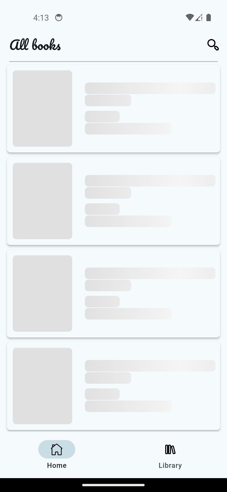 | 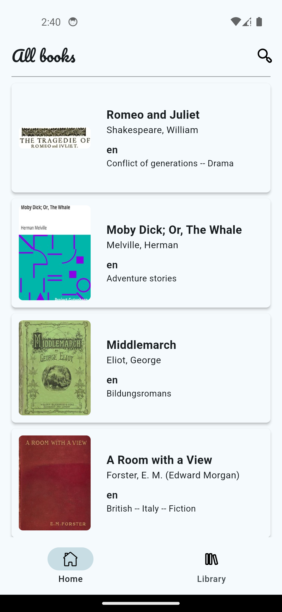 | 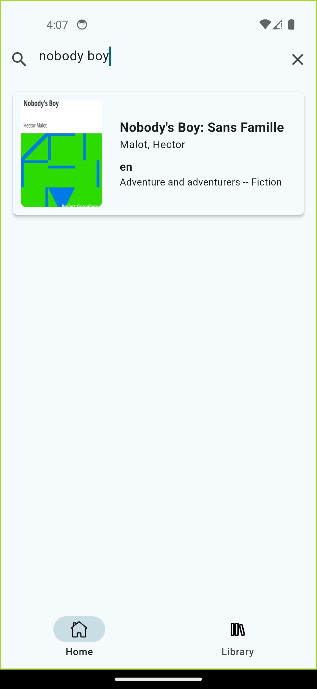 | 
|-------------------------------------------------------|-------------------------------------------------------|-------------------------------------------------------|
| 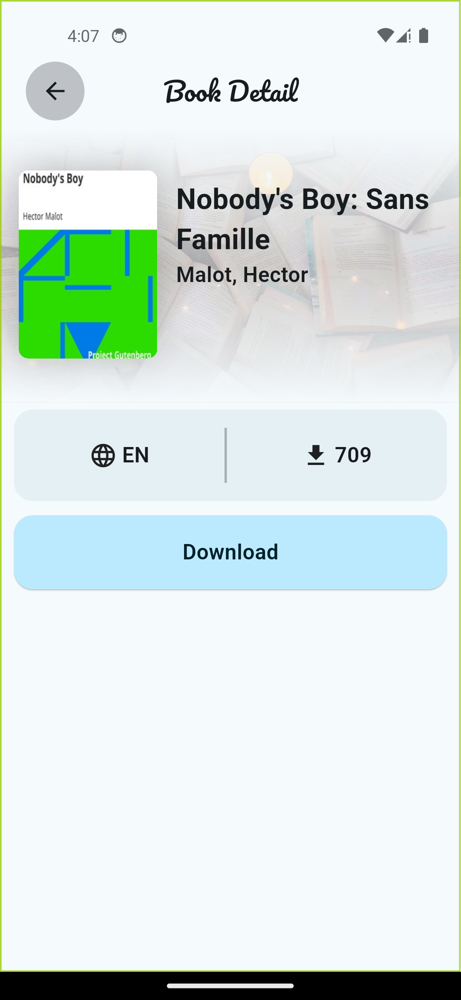 | 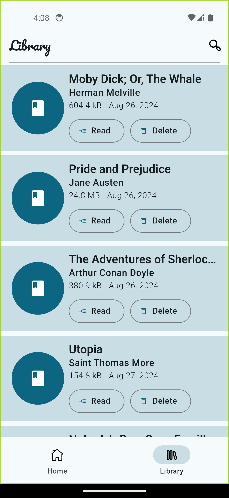 | 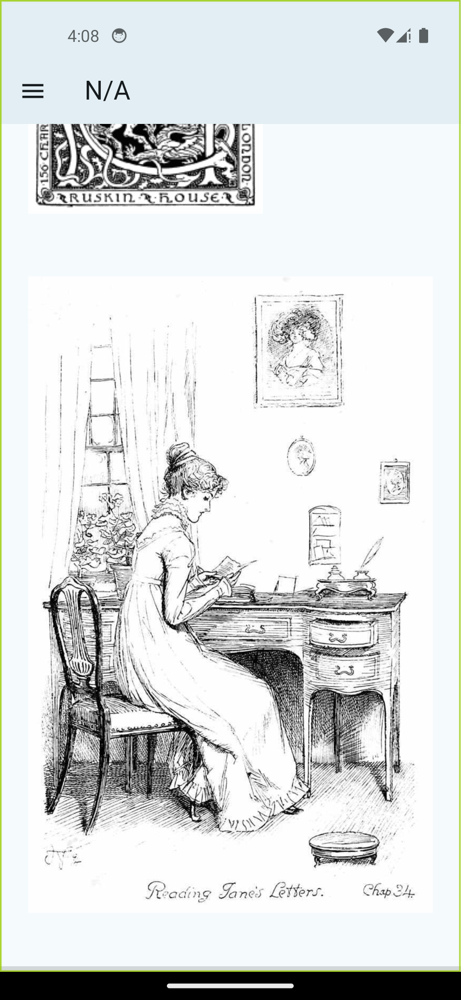 | 

------

<h2 align="center">iOS Screenshots</h2>

| 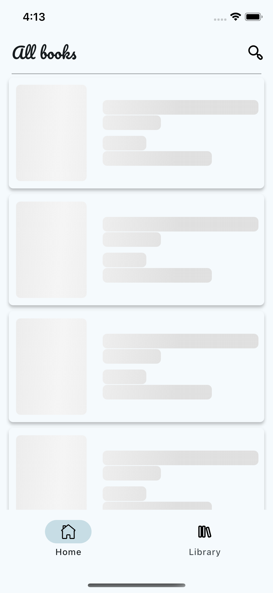 | 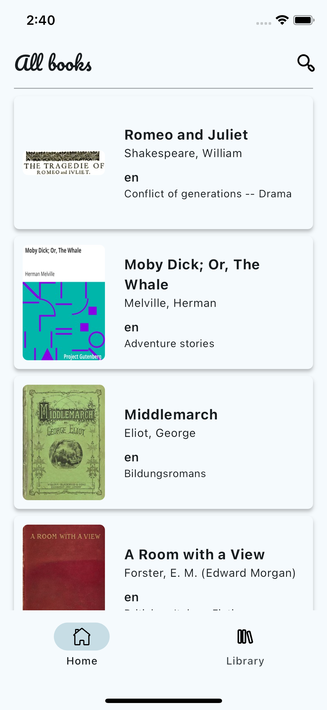 | 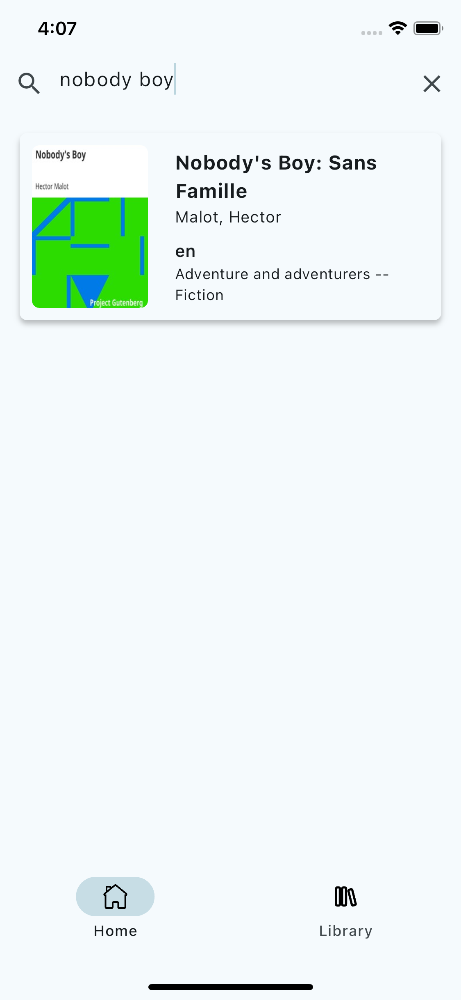 |
|-------------------------------------------------------|-------------------------------------------------------|-------------------------------------------------------|
| 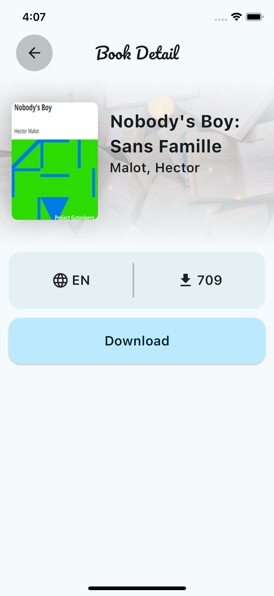 | 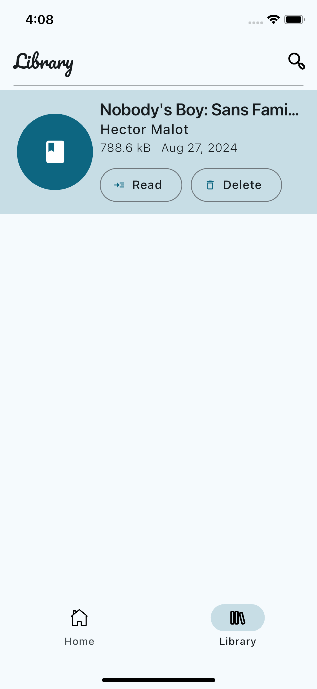 | 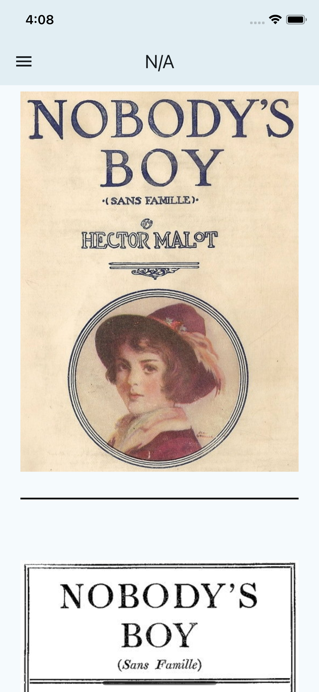 |

------